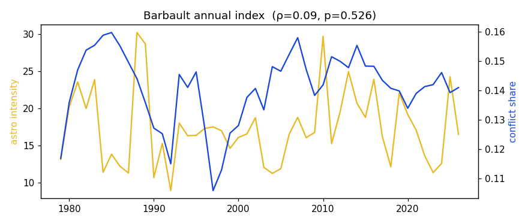
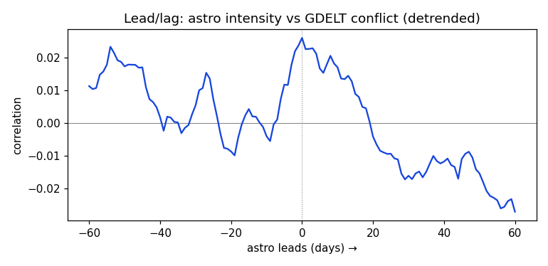
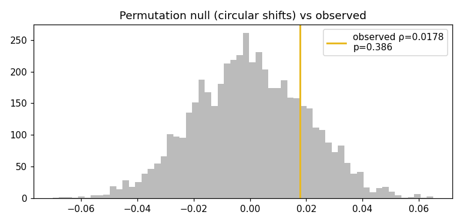

# ArtaAstro backtest — results

_Auto-generated by `backtest.py`. The intensity model (`intensity.py`) was frozen **before** any GDELT data was loaded and was never tuned against it._

**Ground truth:** GDELT 1.0 global daily aggregates, entire history  
**Overlap span:** 1979-01-01 → 2026-07-05 (17,353 days)  
**Engine:** kerykeion (sidereal Lahiri) + swisseph; a-priori intensity model

## Headline — does the astrological signal anticipate real conflict?

| Metric | Value | Null p-value | Chance? |
|---|---|---|---|
| Spearman ρ (detrended) | +0.0178 | 0.386 | **not significant** |
| ROC-AUC (top-decile conflict days) | 0.5147 | 0.317 | **not significant** |
| Precision@k | 0.1158 | (base rate 0.1000) | — |
| Spearman ρ (raw levels) | +0.0548 | — | — |
| Best lead/lag correlation | +0.0271 @ +60 days | — | — |
| Barbault annual index (ρ over 48 yrs) | +0.0917 | 0.526 | **not significant** |

Null = 5,000 circular time-shifts of the astro signal (preserves its autocorrelation). AUC 0.5 and ρ 0 are the no-skill baselines.

## Other conflict measures (same test)

| GDELT measure | Spearman ρ (detrended) | null p | AUC |
|---|---|---|---|
| conflict_share | +0.0187 | 0.379 | 0.5068 |
| neg_goldstein | +0.0135 | 0.521 | 0.5079 |
| neg_tone | +0.0120 | 0.588 | 0.5196 |

## Split stability

| Era | Spearman ρ (detrended) | null p | AUC | days |
|---|---|---|---|---|
| 1979-2012 | +0.0166 | 0.411 | 0.5116 | 12,419 |
| 2013-now | +0.0248 | 0.519 | 0.5253 | 4,934 |

## Conclusion

**No measure beats chance.** Across the entire GDELT history, the a-priori sidereal-Lahiri event-intensity signal shows correlation and classification skill indistinguishable from a randomly time-shifted copy of itself. Effect sizes are near zero (ρ ≈ 0, AUC ≈ 0.5). This is the honest result: the model produces a real, precise sky-reading for every day — but it does **not** forecast world events.

